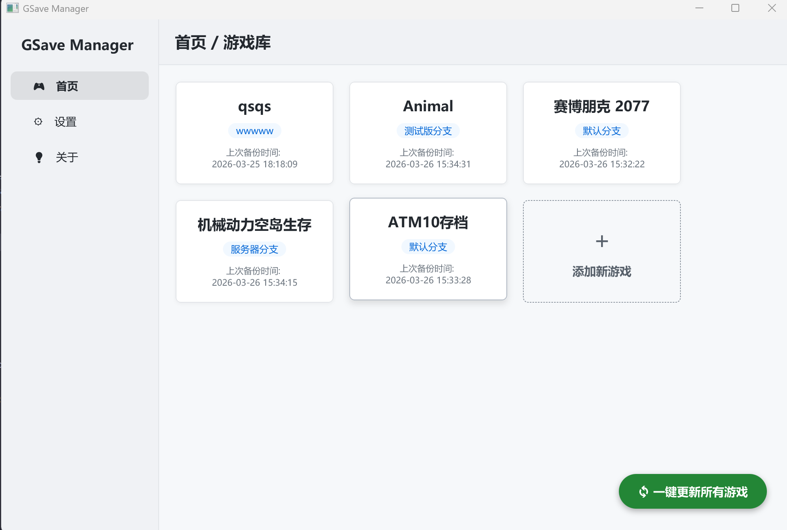
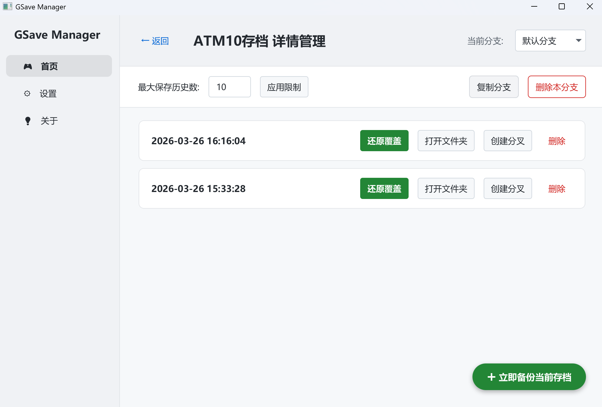

# 🎮 GSave Manager (游戏存档管理器)

感谢使用 **GSave Manager**！这是一款源于作者自用需求、为单机游戏玩家制作的本地存档管理工具。你可以用来保存 Minecraft 不同阶段的建筑，也可以用来尝试 RPG 游戏的不同剧情选项。

## 💡 三级结构设计

1. **游戏存档 (`Game`)**：最顶层的结构，区分不同的存档（如：*Minecraft-机械动力生存*）。如果你想也可以直接当分支功能用。
2. **独立分支 (`Branch`)**：平行存档。可以用当下或已存的某个时间点的存档分叉出不同的时间线（如：*和平线*、*普通线*）。默认情况下，所有新游戏都会有一个“默认分支”。
3. **存档时间点 (`Timestamp`)**：顾名思义，你可以随时将当前硬盘里的存档回滚到任意一个备份的时间点。

## 🚀 快速上手

### 1. 添加新游戏入库
点击主界面的 **「+ 添加新游戏」** 卡片。
此时系统会要求你选择**该游戏真实的本地存档路径**。
**举个例子：** 如果你要备份 Minecraft 的某个具体世界，请导航并选择类似于 `...\.minecraft\saves\新的世界` 的文件夹，然后为它起个名字，完成入库。

### 2. 存档分支
在游戏的详情页，你可以进行分支相关的操作：
* **创建分叉**：在游戏中面临两难的抉择？想要创造另一条时间线？你可以选择一个“时间戳”，点击「创建分叉」。软件会以此为起点，创建一条新的分支。
* **复制分支**：将当前分支的所有备份克隆一份，方便你在此基础上进行破坏性测试。
* **还原覆盖**：找到你想要回退的时间戳，点击「还原覆盖」。***⚠ 注意：这是软件中唯一会直接修改你源游戏文件的操作。*** 它会将你当下的游戏存档清空，并用选择的备份替换。

### 3. 日常备份与更新
本软件的备份逻辑是**单向**的。
* **一键更新所有游戏**：点击主界面右下角的相应按钮，软件会扫描你所有入库的存档（保存的路径），并将当下硬盘里的存档数据分别备份到各自的最新分支中。
* **立即备份当前存档**：在特定游戏的详情页右下角，点击相应按钮可为当前分支生成一个当下时间点的新备份。

## 数据安全与声明
除了「还原覆盖」操作外，软件内的**所有“删除”操作（包括删除单条记录、删除分支、在首页右键删除游戏），均只会抹除软件 Backup 文件夹内的备份文件**。

*本软件在UI方面使用LLM工具辅助开发。*